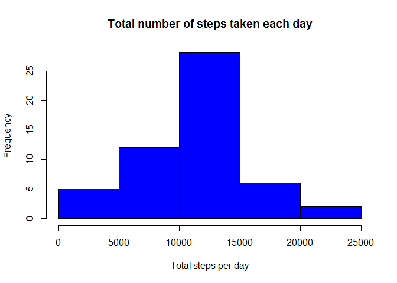
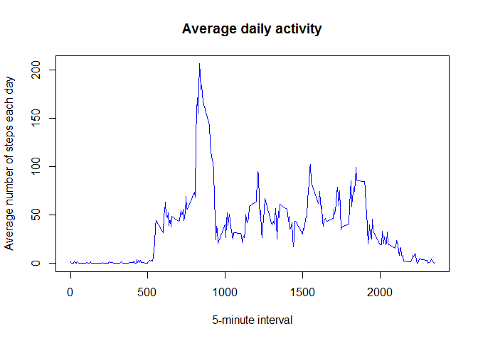
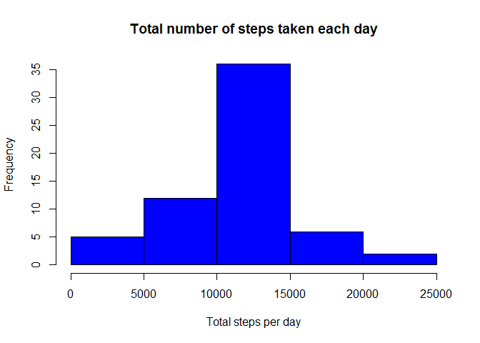
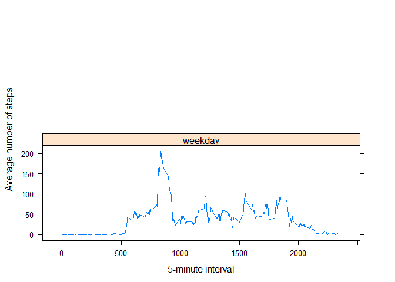

# Reproducible Research: Peer Assessment 1

##Introduction

It is now possible to collect a large amount of data about personal movement using activity monitoring devices such as a Fitbit, Nike Fuelband, or Jawbone Up. These type of devices are part of the "quantified self" movement - a group of enthusiasts who take measurements about themselves regularly to improve their health, to find patterns in their behavior, or because they are tech geeks. But these data remain under-utilized both because the raw data are hard to obtain and there is a lack of statistical methods and software for processing and interpreting the data.

Here, we will use data from a personal activity monitoring device. This device collects data at 5 minute intervals through out the day. The data consists of two months of data from an anonymous individual collected during the months of October and November, 2012 and include the number of steps taken in 5 minute intervals each day.

The variables included in this dataset are:

- **steps:** Number of steps taking in a 5-minute interval (missing values are coded as NA)
- **date:** The date on which the measurement was taken in YYYY-MM-DD format
- **interval:** Identifier for the 5-minute interval in which measurement was taken

The dataset is stored in a comma-separated-value (CSV) file and there are a total of 17,568 observations in this dataset.

We will conduct a short analysis of the data as follow:

1. Loading and preprocessing the data
2. Mean total number of steps taken per day
3. Average daily activity pattern
4. Imput missing values
5. Differences in activity patterns between weekdays and weekends

## Loading and preprocessing the data


```r
#Loading data
activity <- read.csv(file = unzip(zipfile = "./activity.zip"), na.strings = "NA")

#Preprocessing to remove missing values and make data suitable for analysis
activity_noNA <- activity[complete.cases(activity),]
```

Now our dataset is ready for analysis.

## What is mean total number of steps taken per day?


```r
# Calculate the total number of steps taken per day and store it in a data frame
total_steps_pday <- tapply(activity_noNA$steps, factor(activity_noNA$date), sum)

# Make a histogram of the total number of steps taken each day
hist(total_steps_pday, main = "Total number of steps taken each day", xlab = "Total steps per day", col = "blue")
```

\

```r
# Calculate and report the mean and median of the total number of steps taken per day
total_mean <- mean(total_steps_pday)
total_median <- median(total_steps_pday)
```

The mean of the total number of steps taken per day is 1.0766189\times 10^{4} and the median is 10765.

## What is the average daily activity pattern?


```r
# Make a time series plot of the 5-minute interval (x-axis) and the average number of steps taken, averaged across all days (y-axis)
time_series <- tapply(activity_noNA$steps, activity_noNA$interval, mean)
plot(names(time_series), time_series, type = "l", xlab = "5-minute interval", ylab = "Average number of steps each day", main = "Average daily activity", col = "blue")
```

\

```r
# Which 5-minute interval, on average across all the days in the dataset, contains the maximum number of steps?
interval <- which.max(time_series)
interval_max <- names(interval)
steps_max <- round(max(time_series))
```

The 5-minute interval that contains the maximum number of steps (on average across all the days in the dataset) is the 835th with an average of 206 steps.

## Imputing missing values


```r
# Calculate and report the total number of missing values in the dataset (i.e. the total number of rows with NAs)
total <- sum(is.na(activity))
```

The total number of missing values in the dataset is 2304.


```r
# Fill in all of the missing values with the mean for that 5-minute interval across all dataset. Create a new dataset (called "activity_impNA) that is equal to the original dataset but with the missing data filled in.

activity_impNA <- activity

for (i in 1:nrow(activity_impNA)) {
    if (is.na(activity_impNA$steps[i])) {
        activity_impNA$steps[i] <- mean(activity_impNA$steps[activity_impNA$interval == activity_impNA$interval[i]], na.rm=TRUE)
    }
}

# Make a histogram of the total number of steps taken each day and calculate and report the mean and median total number of steps taken per day. 
total_steps_pday2 <- tapply(activity_impNA$steps, factor(activity_impNA$date), sum)
total_mean2 <- mean(total_steps_pday2)
total_median2 <- median(total_steps_pday2)

hist(total_steps_pday2, main = "Total number of steps taken each day", xlab = "Total steps per day", col = "blue")
```

\

**Do these values differ from the estimates from the first part of the report? What is the impact of imputing missing data on the estimates of the total daily number of steps?**

The mean of the total number of steps taken per day is 1.0766189\times 10^{4}. The estimate from the first part of the report was: 1.0766189\times 10^{4}. The median is 1.0766189\times 10^{4}, it was previously 10765.

We can see that the means are equal. This is because we imputed the mean if the corresponding 5-minute interval on missing values. Medians are very close as well.

## Are there differences in activity patterns between weekdays and weekends?


```r
# Create a new factor variable in the dataset with two levels - "weekday" and "weekend" indicating whether a given date is a weekday or weekend day
week <- weekdays(strptime(activity_impNA$date, format = "%Y-%m-%d"))
for (i in 1:length(week)){
    if (week[i] == "Saturday" | week[i] == "Sunday"){
        week[i] <- "weekend"
    } 
    else {
        week[i] <- "weekday"
    }
}
week <- as.factor(week)
activity_impNA$weektime <- week

# Make a panel plot containing a time series plot (i.e. type = "l") of the 5-minute interval (x-axis) and the average number of steps taken, averaged across all weekday days or weekend days (y-axis)
activity_final <- aggregate(steps ~ interval + week, data = activity_impNA, mean)

library(lattice)

xyplot(steps ~ interval | week, data = activity_final, type = "l", layout = c(1, 2), xlab = "5-minute interval", ylab = "Average number of steps")
```

\
